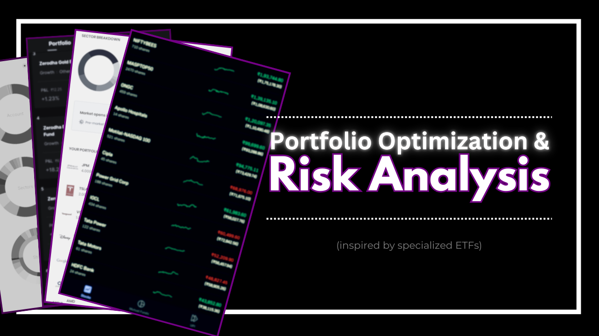
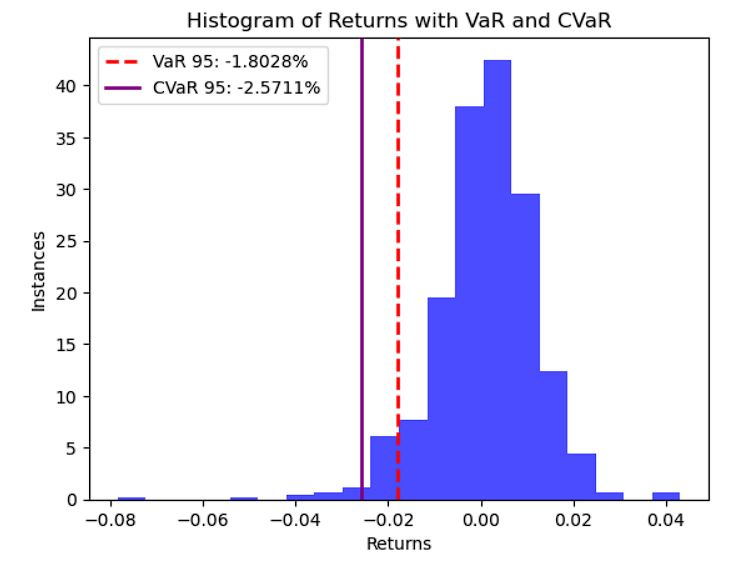
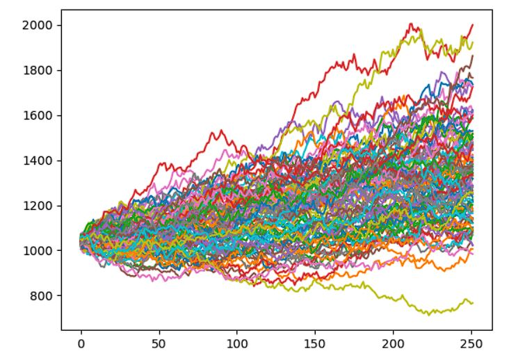
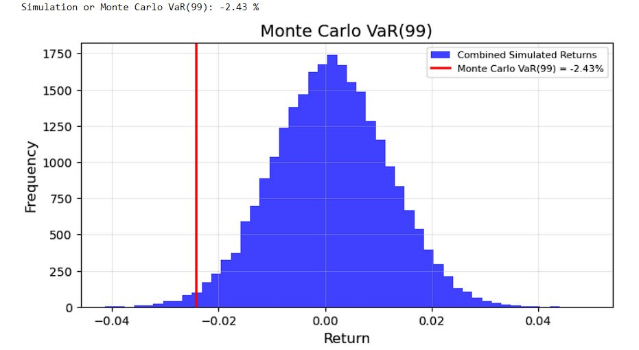
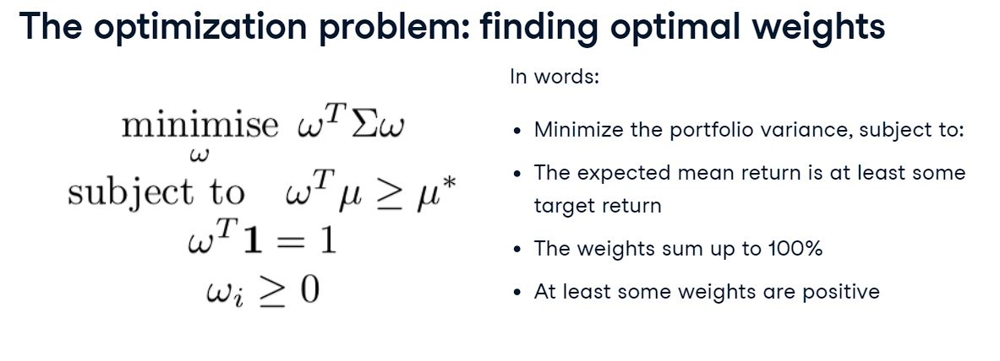
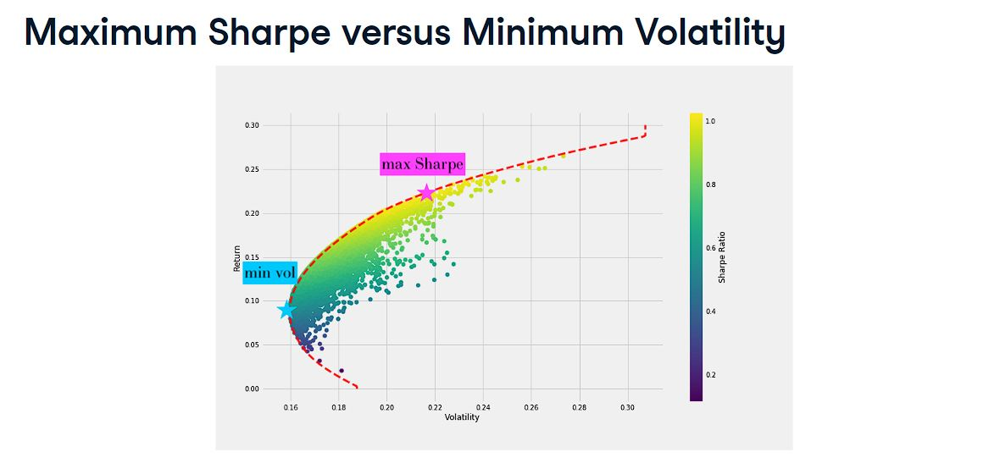

Inspired by many **specialized ETFs** (An investment vehicle that pools a group of securities into a fund. It can be traded like an individual stock on an exchange). Creating a basket of stocks with weights for **specific investment strategies or weighting criteria beyond traditional market-capitalization indexes and treating them all as a unit.**
 

A portfolio, if selected properly, is less vulnerable to extreme highs and lows, and provides the benefits of diversification.
 
### [View Portfolio Analysis of US stocks with Python](https://github.com/s1dewalker/Portfolio_Analysis/blob/main/Portfolio_Analysis.ipynb)  
### [Meet Min Volatility and Max Sharpe Ratio on the EfficientFrontier of NSE stocks](https://github.com/s1dewalker/Portfolio_Analysis/blob/main/ETFs.ipynb)
### [View Risk Analysis in Python](https://github.com/s1dewalker/Portfolio_Analysis/blob/main/py_files/RiskAnalysis.ipynb)
  

# 1. Data Extraction and Portfolio Construction  
Utilized `yfinance` for data retrieval of NSE stocks, obtaining historical price data for a specified date range.  
 
'df' is the DataFrame that contains daily prices of stocks.  
'weights' is the array that contains portfolio weights.  
- `returns = df.pct_change()`  
  `returns.dropna(inplace = True)`

Portfolio construction w/ stock returns
- `returns_pf = returns.dot(weights)`

Portfolio construction w/ stock values
- `pf_AUM = df.dot(weights)`
 

# 2. Risk Analysis - Some Basic Portfolio Risk Metrics  

## Annualized return  

#### Q. Why annualize returns?  
- To account for compounding effect
- To compare portfolios with different time periods
- Average return can be deceiving (example: if portfolio loses all its value in the end the average may be > 0%, but final return is 0%)
 

Annualizing returns:
- `total_return = (pf_AUM[-1] - pf_AUM[0]) / pf_AUM[0]`
- `annualized_return = ((1 + total_return) * * (12 / months)) - 1`

## Annualized Volatility  
- `pf_returns = pf_AUM.pct_change()`
- `pf_vol = pf_returns.std()`
- `pf_vol = pf_vol * np.sqrt(250)`

#### Q. Why multiply with sqrt(250)
250: trading days in a year (annual)
sqrt: variance annualized = 250 * variance daily.  
Therefore, standard deviation annualized = sqrt(250) * standard deviation daily.
 

## Risk-adjusted return | Sharpe Ratio | Efficiency of risk taking  

- `sharpe_ratio = ((annualized_return - rfr) / pf_vol)`

## Portfolio Variance and Volatility  

- `cov_matrix = (returns.cov())*250 ` 
- `port_variance = np.dot(weights.T, np.dot(cov_matrix, weights))`
- `port_standard_dev = np.sqrt(port_variance)`

[View Portfolio Variance derivation](https://github.com/s1dewalker/Portfolio_Analysis/blob/main/Portfolio_variance.pdf)  

#### Q. Why annualizing covariance?
so that we calculate the annualized volatility later.  

#### Q. Why portfolio variance formula instead of standard deviation?
**Precision**: As stocks are **correlated** to each other, we need to account for **correlations** b/w stocks. This gives more **precision** in measuring volatility.  
It can be forward looking if covariance matrix is estimated or forecasted.  

#### Q. Benefits of historical method?
Historical data method can include rebalancing.  

## Skewness
Skewness measures the asymmetry of the distribution of data around its mean.  
- `pf_returns.skew()`

Risk management: Investors should seek positive skew as in the long run:  
few positive bets should create a positive expectancy  

## Kurtosis
Kurtosis measures the "tailedness" of the data distribution, indicating the presence of outliers.  
- `pf_returns.kurtosis()`
 
k>3: FAT (leptokurtic) | high risk-high reward

  

# 3. Risk Analysis - Value at Risk (VaR)  

 Finding var95 and cvar95: 
- `var = np.percentile(returns_pf, 5)`
- `cvar = returns_pf [returns_pf <= var].mean()`

Monte Carlo Simulation: 

Monte Carlo VaR: 

### [View Complete Risk Analysis](https://github.com/s1dewalker/Portfolio_Analysis/blob/main/py_files/RiskAnalysis.ipynb) with 15 Portfolio Risk metrics including 5 VaR metrics
  

# 4. Factor Investing
**The Fama-French 3 factor model** tells us **what drives portfolio returns** and **quantifies their contributions**.
Risk management: 
- Identifies exposure to specific factors (size, value)
- Optimize portfolio by adjusting exposures
- Evaluate performance

### [View Factor Analysis of NSE stocks in Python](https://github.com/s1dewalker/Portfolio_Analysis/blob/main/py_files/Factor_Analysis.ipynb)
### [View Multi Factor Analysis of NYSE stocks in Python](https://github.com/s1dewalker/Portfolio_Analysis/blob/main/py_files/Multi_Factor_Analysis.ipynb)
  

# 5. Portfolio Optimization | Efficient Frontier

## Optimal weights  

## Efficient Frontier  

**The efficient frontier is the set of portfolios that achieve the highest return for a given risk or the lowest risk for a given return, representing optimal diversification.**  
[View Portfolio Optimization maths](https://github.com/s1dewalker/Portfolio_Analysis/blob/main/Portfolio_Optimization.pdf)  
 

### [View Complete Portfolio Optimization](https://github.com/s1dewalker/Portfolio_Analysis/blob/main/ETFs.ipynb) of NSE stocks

##### Python libraries: 
##### `pandas, numpy, yfinance, matplotlib, PyPortfolioOpt, EfficientFrontier` 
 

*hope you find it helpful, and encourage you to forward any suggestions for improvements*  
##### [LinkedIn](https://www.linkedin.com/in/sujay-bhaumik-d12/)
