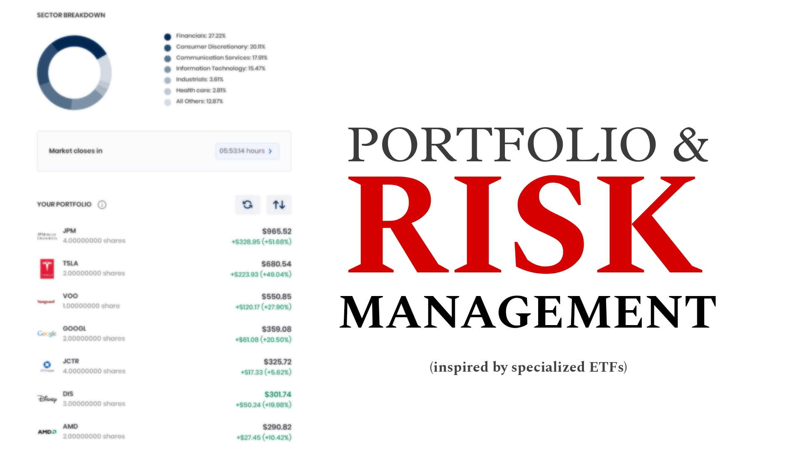
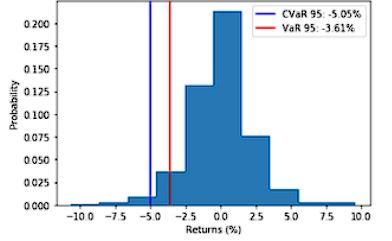

Inspired by many **specialized ETFs** (An investment vehicle that pools a group of securities into a fund. It can be traded like an individual stock on an exchange). Creating a basket of stocks with weights for **specific investment strategies or weighting criteria beyond traditional market-capitalization indexes and treating them all as a unit.**
 

A portfolio, if selected properly, is less vulnerable to extreme highs and lows, and provides the benefits of diversification.
 
#### [View Portfolio Analysis of US stocks with Python](https://github.com/s1dewalker/Portfolio_Analysis/blob/main/Portfolio_Analysis.ipynb)  
#### [Meet Min Volatility and Max Sharpe Ratio on the EfficientFrontier of NSE stocks](https://github.com/s1dewalker/Portfolio_Analysis/blob/main/ETFs.ipynb)
  

# 1. Data Extraction and Portfolio Construction  
Utilized `yfinance` for data retrieval of NSE stocks, obtaining historical price data for a specified date range.  
 
'df' is the DataFrame that contains daily prices of stocks.  
'weights' is the array that contains portfolio weights.  
- `returns = df.pct_change()`  
  `returns.dropna(inplace = True)`
- `returns_pf = returns.dot(weights)`

# 2. Value at Risk (VaR) | Historical VaR | Expected Shortfall (CVaR)  

 Finding var95 and cvar95: 

- `var = np.percentile(returns_pf, 5)`
- `cvar = returns_pf [returns_pf <= var].mean()`

  

# 3. Portfolio Risk Metrics  

## Annualized return  
- `pf_AUM = df.dot(weights)`
- `total_return = (pf_AUM[-1] - pf_AUM[0]) / pf_AUM[0]`
- `annualized_return = ((1 + total_return) * * (12 / months)) - 1`

## Risk-adjusted return | Sharpe Ratio | Efficiency of risk taking  

- `pf_returns = pf_AUM.pct_change()`
- `pf_vol = pf_returns.std()`
- `pf_vol = pf_vol * np.sqrt(250)`
- `sharpe_ratio = ((annualized_return - rfr) / pf_vol)`

## Portfolio Optimization | Efficient Frontier

### Portfolio Variance  
- `cov_matrix = (returns.cov())*250 `
- `port_variance = np.dot(weights.T, np.dot(cov_matrix, weights))`
##### [View Portfolio Variance derivation](https://github.com/s1dewalker/Portfolio_Analysis/blob/main/Portfolio_variance.pdf)  

### Optimal weights  

### Efficient Frontier  

The efficient frontier is the set of portfolios that achieve the highest return for a given risk or the lowest risk for a given return, representing optimal diversification.  
##### [View Portfolio Optimization maths](https://github.com/s1dewalker/Portfolio_Analysis/blob/main/Portfolio_Optimization.pdf)  
  

##### Python libraries: 
##### `pandas, numpy, yfinance, matplotlib, PyPortfolioOpt, EfficientFrontier` 
 

*hope you find it helpful, and encourage you to forward any suggestions for improvements*  
##### [LinkedIn](https://www.linkedin.com/in/sujay-bhaumik-d12/)
