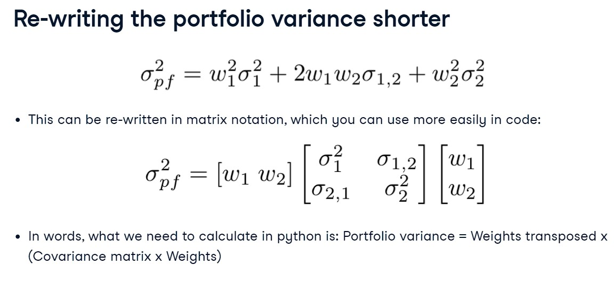

# ETF Portfolio and Risk Analysis
### [Portfolio Analysis with Python](https://github.com/s1dewalker/Portfolio_Analysis/blob/main/Portfolio_Analysis.ipynb)  
### [Portfolio Analysis & EfficientFrontier ETFs of NSE stocks](https://github.com/s1dewalker/Portfolio_Analysis/blob/main/ETFs.ipynb)
  

## Data Extraction and Preprocessing  
Utilized **yfinance** for data retrieval of NSE stocks, obtaining historical price data for a specified date range

## Value at risk | Historical (VaR) | Expected Shortfall (CVaR)  
'df' is the DataFrame that contains daily prices of stocks.  
'weights' is the array that contains portfolio weights.  
 Finding var95 and cvar95: 
- returns = df.pct_change()  
  returns.dropna(inplace = True)
- returns_pf = returns.dot(weights)
- var = np.percentile(returns_pf, 5)
- cvar = returns_pf [returns_pf <= var].mean()

## Annualized return  
- pf_AUM = df.dot(weights)
- total_return = (pf_AUM[-1] - pf_AUM[0]) / pf_AUM[0]
- an_return = ((1 + total_return) * * (12 / months_ diff)) - 1

## Risk-adjusted return | Sharpe Ratio | Efficiency of risk taking  

- pf_returns = pf_AUM.pct_change()
- pf_vol = pf_returns.std()
- pf_vol = pf_vol * np.sqrt(250)
- sharpe_ratio = ((annualized_return - rfr) / pf_vol)

## Efficient Frontier

Portfolio Variance  
  

Optimal weights  
  

Efficient Frontier  
  
